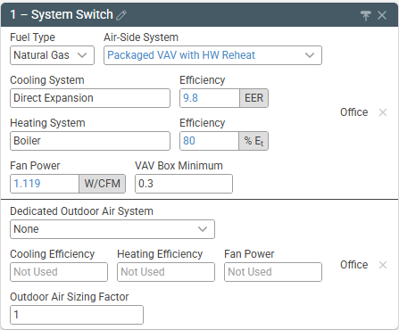

# Frequently Asked Questions

## Can I create a measure that will change the HVAC system type?

Yes, you can create a system switch measure using the custom "HVAC System Type" parameter in a user-defined measure as seen in the image below. This measure allows you to change system type, set efficiencies for the new system, and change the DOAS system type/efficiency.

## How can I model an un-conditioned space?

Currently there is no built-in way to model an unconditioned space, however this is a feature on our current wish-list. As a work-around we suggest this approach:

 - Design Tab
   - Building Type = Parking Garage
   - Air-Side System = Heating Only (Natural Gas)
 - Schedule Tab
   - Weekday Use Simple Thermostats = Yes
   - Weekend Use Simple Thermostats = Yes (this one can be easy to miss!)
   - Heating Setpoint Occupied = 0 °F
   - Heating Setpoint Unoccupied = 0 °F
 - Baseline Tab
   - Fan Power = 0 W/CFM

## How can I create a model in a city or country that isn't listed on the Project tab?

This functionality is not currently available. However if there is a location you'd like to see support, please let us know by contacting [tools@slipstreaminc.org](mailto:tools@slipstreaminc.org).

## Can I export hourly data from Sketchbox?

There isn't a way to get hourly data directly from Sketchbox. However, by clicking the "Download Archive" button at the top of the results tab, the inp and prd files can be downloaded and opened in eQuest 3.64. From there, more detailed results can be extracted from the model.
