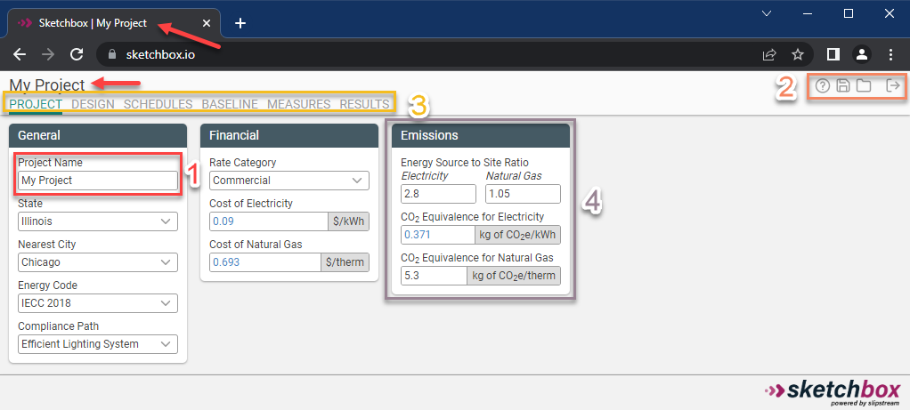

# Getting started

This page gives an overview of how to create an account, and getting familiar with the Sketchbox interface.

## Creating an account

To create an account, go to [sketchbox.io/login](https://www.sketchbox.io/login) and click "Create an account".

Complete the form, acept the [EULA](https://www.sketchbox.io/eula), and click "Send Verification Email".

The verification email should arrive to your inbox shortly; if it does not, be sure to check your spam folder.

## The interface

The key components of the Sketchbox interface are highlighted in this image and described below.

1. **Project Name.** When the project name is edited in the [Project tab](#project-tab), the title and heading will also be updated. By default, the project name will also be used when saving the project.
2. **Webapp functions.** There are four webapp functions across all views in Sketchbox:
    - **Help.** Access this documentation.
    - **Save.** Save a project to your account, or download a file to share with others.
    - **Load.** Load a saved project from your account or from a Ripple file.
    - **Logout.** Log out of your account.
3. **Project tabs.** Each tab is used to modify and view different aspects of the energy model. The function of each is described in detail in [Sketchbox tabs](#sketchbox-tabs).
4. **Input groups.** Related inputs and results are grouped together under headings. The color of the heading corresponds to the [shell](#shells) to which the group applies. In this example, the "Emissions" input group is highlighted.

## Sketchbox tabs

Every project has tabs where you can view and enter information about the project, described in detail below.

### Project tab

This is where basic project information is inputted.

1.  Give your project a name
2.  Project Environment typically left as "Standard"
3.	Choose the nearest city for the project
4.	Select the appropriate code baseline

### Design tab

The Design tab is where the building comes to life. Below is a brief description of the essential functions of the tab.

1. Shells:

Buildings in Sketchbox consist of one or more shells. A shell is a simplified representation of a building geometry with uniform loading, schedule, lighting, and HVAC systems. Each shell consists of at least 5 thermal zones (core + perimeters) and represents all rooms/spaces within that part of the building. Generally, it is not important to accurately represent every geometric detail of the architectural design; aim to accurately represent the gross floor area, number of floors, floor to floor height, exterior surface area (aspect ratio input), and window wall ratio (percentage of glazing) on each façade.

The number of shells should be minimized. Shells should not be used to represent a single room or a type of space such as a corridor. Multiple shells can be combined to form a building with diverse space programming, more complex geometry, or different HVAC configurations. Shells can be attached, which reduces exterior heat transfer and glazing. Shells can be inside other shells to represent unique areas without significant exterior exposure (such as small offices scattered throughout a warehouse).

Building shells are separated based on unique HVAC system types, features, and geometry. Where possible, portions of the building with different HVAC characteristics should be separated into different shells (e.g., HVAC system types, controls, efficiency features such as exhaust air energy recovery, etc.),. If applicable, below-grade portions of the building can be modeled as unique shells. 
Components on the Design tab should be entered as specified in design documents according to the guidance below.

2. HVAC

HVAC Systems should be defined according to the design of the proposed HVAC system type and parameters. 

Many common HVAC configurations are represented in Sketchbox, including both gas and electrically heated systems. Highly specialized systems, hybrid systems, and antiquated systems are not represented; however, reasonable approximations can usually be made with the most similar available system. First select the heating fuel type (gas or electric), then select the appropriate air-side system, then select the appropriate heating/cooling plant equipment (where applicable).

Dedicated outside air (DOAS) systems may be selected for some system types. This should be used when delivery of the ventilation air in the proposed design is decoupled (uses separate equipment and ductwork) from the primary heating and cooling systems. DOAS systems are often used in buildings larger multifamily residential buildings andwith certain higher-performing HVAC systems including ground-source heat pump, VRF, etc. A gas-fired and direct-expansion (DX) cooled DOAS system may be selected or the DOAS system can be selected that match the heating/cooling configuration of the primary HVAC system. Selecting “None” for DOAS means that outside ventilation air will be brought in through the primary HVAC system.
The type of domestic hot water selected should align with the type specified in the proposed design.

### Schedules tab

### Baseline tab

### Measures tab

### Results tab

## Shells

By default, every project has two shells; the base building, and the site, where details about things external to the building are stored (such as parking lots and exterior lighting).

Within any tab you can switch shells by clicking the radio button next to each. You can add or remove shells in the Design tab.
