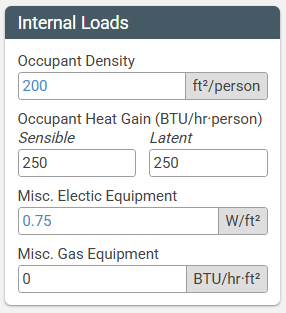
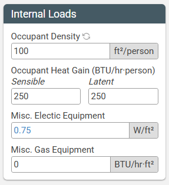

# Getting started

This page will show you how to create a Sketchbox account, walk you through the interface, and help you familiarize yourself with the various tabs.

## Creating an account

To create an account, go to [sketchbox.io/login](https://www.sketchbox.io/login) and click "Create an account".

Complete the form, acept the [EULA](https://www.sketchbox.io/eula), and click "Send Verification Email".

The verification email should arrive to your inbox shortly; if it does not, be sure to check your spam folder.

## The interface

The key components of the Sketchbox interface are highlighted in this image and described below.

1. **Project Name.** When the project name is edited in the [Project tab](#project-tab), the title and heading will also be updated. By default, the project name will also be used when saving the project.
2. **Webapp functions.** There are four webapp functions across all views in Sketchbox:
    - **Help.** Access this documentation.
    - **Save.** Save a project to your account, or download a file to share with others.
    - **Load.** Load a saved project from your account or from a Ripple file.
    - **Logout.** Log out of your account.
3. **Project tabs.** Each tab is used to modify and view different aspects of the energy model. The function of each is described in detail in [Sketchbox tabs](#sketchbox-tabs).
4. **Input groups.** Related inputs and results are grouped together under headings. The color of the heading corresponds to the [shell](#shells-anchor) to which the group applies. In this example, the "Emissions" input group is highlighted.

## Parameter inputs

When modifying inputs in Sketchbox, you'll notice two types of values: values that default to black text, and values that default to blue text. 

If an input parameter has black font, it is constant, meaning it does not depend on another building parameter.

If an input parameter has blue font, it is variable, meaning the value displayed depends on another building parameter. The most common examples of parameters that would affect other input values are "Building Type" (chosen on the Design tab) and "Energy Code" (chosen on the Home tab). If you modify a value that's originally displayed with blue text, you'll see a "refresh" icon appear. When clicked, the value you changed will return to it's original default value. See below for two screenshots of the same Input Group before and after a variable is changed.

## Sketchbox tabs

Every project has tabs where you can view and enter information about the project, described in detail below.

### Project tab

This is where basic project information is inputted.

1.  Give your project a name
2.  Project Environment can be left as "Standard"
3.	Choose the nearest city for the project
4.	Select the appropriate code baseline

### Design tab

The Design tab is where the building comes to life. Below is a brief description of the essential functions of the tab.

**Shells**

- Buildings in Sketchbox consist of one or more shells. A shell is a simplified representation of a building geometry with uniform loading, schedule, lighting, and HVAC systems. Each shell consists of at least 5 thermal zones (core + perimeters) and represents all rooms/spaces within that part of the building. Generally, it is not important to accurately represent every geometric detail of the architectural design; aim to accurately represent the gross floor area, number of floors, floor to floor height, exterior surface area (aspect ratio input), and window wall ratio (percentage of glazing) on each façade.
- The number of shells should be minimized. Shells should not be used to represent a single room or a type of space such as a corridor. Multiple shells can be combined to form a building with diverse space programming, more complex geometry, or different HVAC configurations. Shells can be attached, which reduces exterior heat transfer and glazing. Shells can be inside other shells to represent unique areas without significant exterior exposure (such as small offices scattered throughout a warehouse).
- Building shells are separated based on unique HVAC system types, features, and geometry. Where possible, portions of the building with different HVAC characteristics should be separated into different shells (e.g., HVAC system types, controls, efficiency features such as exhaust air energy recovery, etc.),. If applicable, below-grade portions of the building can be modeled as unique shells. 
Components on the Design tab should be entered as specified in design documents according to the guidance below.
- By default, there is also a "Site" shell, where details about things external to the building are stored (such as parking lots and exterior lighting).

**HVAC**

- HVAC Systems should be defined according to the design of the proposed HVAC system type and parameters. 
- Many common HVAC configurations are represented in Sketchbox, including both gas and electrically heated systems. Highly specialized systems, hybrid systems, and antiquated systems are not represented; however, reasonable approximations can usually be made with the most similar available system. First select the heating fuel type (gas or electric), then select the appropriate air-side system, then select the appropriate heating/cooling plant equipment (where applicable).
- Dedicated outside air (DOAS) systems may be selected for some system types. This should be used when delivery of the ventilation air in the proposed design is decoupled (uses separate equipment and ductwork) from the primary heating and cooling systems. DOAS systems are often used in buildings larger multifamily residential buildings andwith certain higher-performing HVAC systems including ground-source heat pump, VRF, etc. A gas-fired and direct-expansion (DX) cooled DOAS system may be selected or the DOAS system can be selected that match the heating/cooling configuration of the primary HVAC system. Selecting “None” for DOAS means that outside ventilation air will be brought in through the primary HVAC system.
The type of domestic hot water selected should align with the type specified in the proposed design.

### Schedules tab

The schedule defaults come from the ASHRAE Handbook and should be used in most cases. Where this is not appropriate, the “Simplified” schedule type may be used to set a start and end time for occupancy. One example where the simplified schedule may be appropriate is in a distribution warehouse or call center that operates 2-shifts or 24 hours.

### Baseline tab

Parameters of the baseline energy model are established first in the typical Sketchbox workflow, using the Baseline tab. 

While baseline values should not be arbitrarily changed, it may be appropriate to modify settings on the “Baseline” tab to accurately reflect the baseline for a project. Some examples of this include: 
- Applying existing envelope U-values where existing building envelope is being reused. This will impact related/interactive measures such as HVAC equipment performance.
- Modifying miscellaneous electric or gas loads to match project expectations. Plug and process loads are not code regulated. Reasonable defaults are provided for each building type but these should be modified if better information is available. Be sure to use realistic operational loads (the sum of all installed equipment) and not the total installed electrical capacity. 
- Updating Occupant Density to match project details. Use realistic occupancy numbers (that the mechanical engineer would use) and not the higher emergency egress numbers that the architect may use.
- Updating baseline lighting power density or other parameter if the Design tab does not explicitly reflect the building use type. Most building types are represented but special types (such as car dealership) may not be represented.
- Updating Ventilation Rate or Humidity Setpoints to match the proposed design.

### Measures tab

The proposed design is represented by applying a series of “Measures” (changes) in the Measures Tab. The user may add individual measures using the "Add Measure" button in the top left, or by clicking the "Add Measure Set" button right next to it. Adding a measure set adds multiple energy conservation measures to the proposed design. This set of measures represents a standard recommendation for high performing buildings. Once a measure or measure set is added, Sketchbox will typically have recommendations for "Better" or "Best" scenarios. 
<!-- To learn more about where these recomentations come from, click [here](#Section link) -->

### Results tab

The Results tab shows all model outputs on an annual and monthly basis, as well as savings results by measure. A summary table of key metrics such as EUI, Energy Cost, kWh Savings, and Therms Savings is also provided. Lastly, a results table is provided which can easily be copied into a template for report formatting. 
